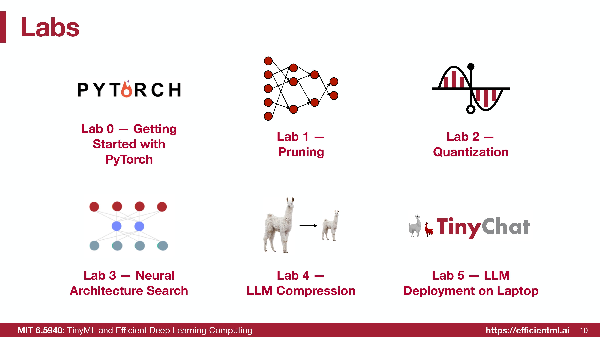

# MIT 6.5940 TinyML and Efficient Deep Learning Computing Practical Labs

This repository contains the implementations for the practical labs of MIT 6.5940 / EfficientML.ai, covering efficient deep learning techniques for model compression, neural architecture search, LLM quantization, and on-device LLM inference optimization.

  

1. Pruning

Objective: Implement and compare pruning techniques for reducing neural network model size and latency, including fine-grained pruning and channel pruning on a VGG model trained on CIFAR-10. This lab studies sparsity, accuracy trade-offs, speedup, and the practical differences between unstructured and structured pruning.

Assignment Details: Notebook: [Lab 1 - Pruning](./Lab1_Pruning.ipynb)

2. Quantization

Objective: Quantize a neural network model to reduce model size and improve inference efficiency. This lab covers k-means quantization, quantization-aware training, linear quantization, and integer-only inference, while comparing the accuracy, latency, and compression trade-offs of different quantization methods.

Assignment Details: Notebook: [Lab 2 - Quantization](./Lab2_Quantization.ipynb)

3. Neural Architecture Search with Once-for-All

Objective: Explore neural architecture search for efficient tiny neural networks that can run under microcontroller-level constraints. This lab uses a Once-for-All supernet, the Visual Wake Words dataset, analytical efficiency prediction, accuracy prediction, random search, and evolutionary search to find high-accuracy subnetworks under MAC and memory constraints.

Assignment Details: Notebook: [Lab 3 - Neural Architecture Search with OFA](./Lab3_Neural_Architecture_Search_OFA.ipynb)

4. LLM Quantization with AWQ

Objective: Implement activation-aware weight-only quantization for large language models. This lab studies pseudo quantization, salient weight channel protection, activation-aware scaling, scale-factor search, and 4-bit weight-only quantization to reduce LLM memory footprint while preserving model quality for edge deployment.

Assignment Details: Notebook: [Lab 4 - LLM Quantization with AWQ](./Lab4_LLM_Quantization_AWQ.ipynb)

5. Optimize LLM on Edge Devices

Objective: Deploy a quantized LLaMA2-7B-chat model with TinyChatEngine and optimize the w4a8 linear kernel for edge-device inference. This lab implements and evaluates loop unrolling, multithreading, SIMD programming, multithreading with loop unrolling, and a combined all-techniques version to improve local chatbot latency and kernel throughput.

Assignment Details: Code Folder: [Lab 5 - Optimize LLM on Edge Devices](./Lab5_optimize_llm_on_edge/)

